

  

<h1 align="center">후파의 야담플로우 사용법</h1>

  <b>공식 사용 설명서</b> · 작성일 2026.10.03 
  튜브워커 프롬프트 엑셀 두 개로 인물시트부터 야담 씬 이미지까지 한 번에 일괄 생성  

   
  👆 위 버튼을 클릭하면 후파의 야담플로우가 열립니다

---

## 목차

1. [준비물](#준비물)
2. [튜브워커에서 프롬프트 받기](#1-튜브워커에서-프롬프트-받기) (1~3단계)
3. [야담플로우에 씬 엑셀 올리기](#2-야담플로우에-씬-엑셀-올리기) (4~6단계)
4. [인물시트(턴어라운드) 생성하기](#3-인물시트턴어라운드-생성하기) (7~10단계)
5. [씬 이미지 일괄 생성](#4-씬-이미지-일괄-생성) (11~13단계)

---

## 준비물

| 파일 | 어디서 얻나요? |
|------|----------------|
| **① 씬이미지 엑셀** | 튜브워커 → 이미지 단계 → **`[야담] 이미지 프롬프트 다운로드`** |
| **② 턴어라운드 엑셀** | 튜브워커 → 이미지 단계 → **`[야담] 인물시트 프롬프트 다운로드`** |

> 💡 인물시트 이미지는 이제 **야담플로우에서 직접 그립니다.** 튜브워커에서 인물시트를 그리거나 이미지를 받을 필요가 없어 **크레딧이 들지 않습니다.**

---

## 1. 튜브워커에서 프롬프트 받기

### 1단계 — 이미지 단계 열기

튜브워커에서 작업 중인 영상의 **이미지 단계**로 갑니다. 인물 시트가 모두 `대기` 상태여도 괜찮습니다. 화면 맨 아래에 **[야담]** 으로 시작하는 버튼들이 보이면 준비 완료입니다.

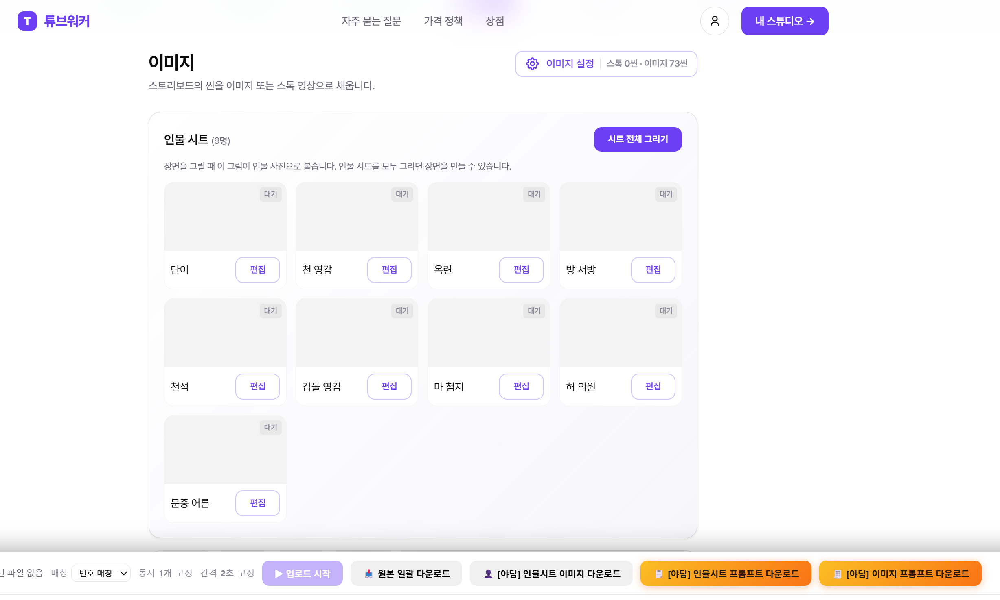

### 2단계 — 🚫 시트 전체 그리기는 누르지 마세요

> ⛔ **`시트 전체 그리기`** 버튼은 누르지 않습니다. 인물시트는 야담플로우에서 그리기 때문에, 여기서 그리면 **크레딧만 낭비**됩니다.

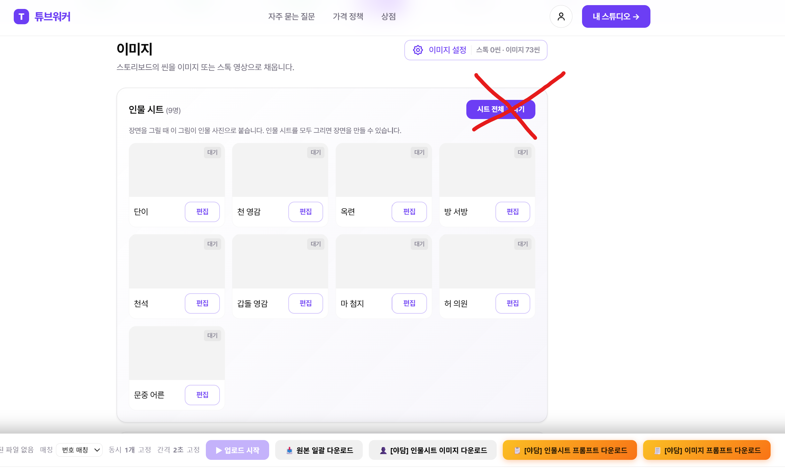

### 3단계 — 프롬프트 엑셀 2개 다운로드

화면 맨 아래 오른쪽의 **주황색 버튼 두 개**를 차례로 눌러 엑셀 파일 두 개를 받습니다.

| 버튼 | 받는 파일 |
|------|-----------|
| **`[야담] 인물시트 프롬프트 다운로드`** | `(② 턴어라운드) …xlsx` |
| **`[야담] 이미지 프롬프트 다운로드`** | `(① 씬이미지) …xlsx` |

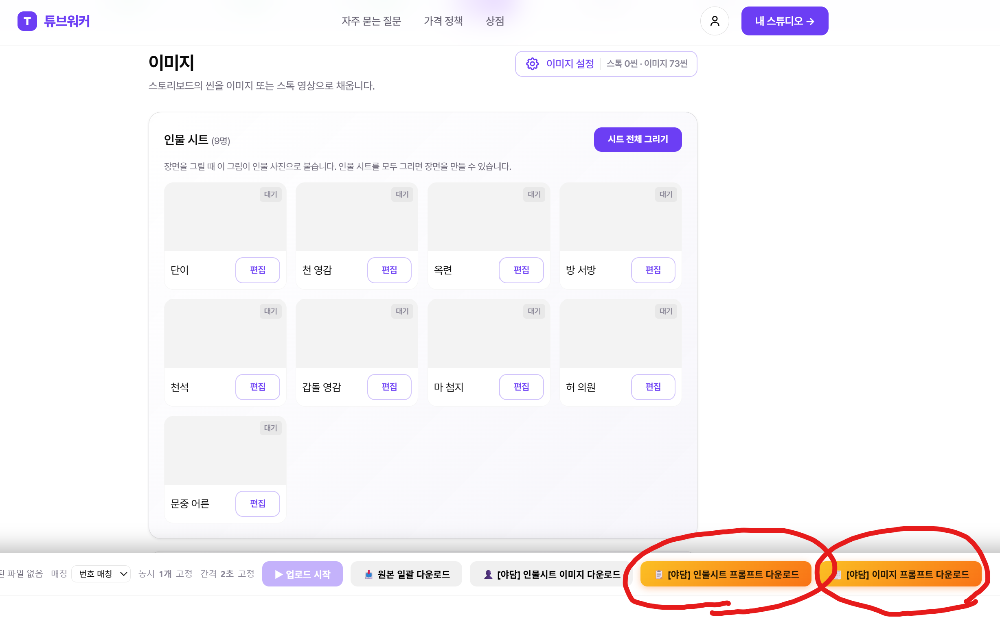

> 💡 버튼이 안 보이면 **이지워커 확장 프로그램을 최신 버전**으로 업데이트해 주세요.

---

## 2. 야담플로우에 씬 엑셀 올리기

### 4단계 — 야담플로우 접속

[후파의 야담플로우](https://flow.google.com/shared/tool/eab79538-f74e-4938-b458-e390d590ed25)에 접속합니다. 처음에는 **이미지 스튜디오** 탭이 열려 있습니다.

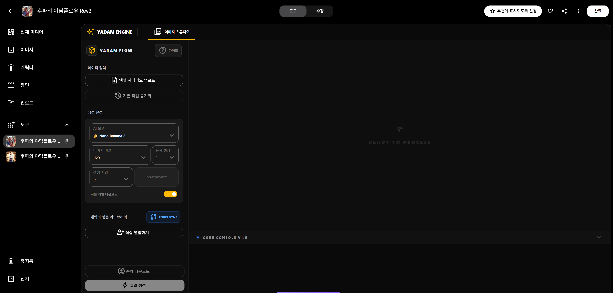

> **🔄 `기존 작업 동기화` 버튼은 언제 쓰나요?**
>
> **이전에 작업했던 이미지를 다시 불러오는 버튼**입니다. 새로고침을 했거나 창을 닫았다가 다시 들어왔을 때, 이미 만든 이미지를 불러와 이어서 작업할 수 있습니다.
>
> 1. **`기존 작업 동기화`** 를 누릅니다.
> 2. 이전에 작업했던 이미지를 **모두 선택**합니다.
> 3. 불러오면 끝입니다.
> - **처음 시작할 때**는 누를 필요가 없습니다. 바로 엑셀을 올리세요.
> - **이미지 스튜디오**와 **턴어라운드 시트 생성기** 탭에 각각 있습니다.

> 💡 이미지를 만들기 전에 **생성 설정**의 **`자동 개별 다운로드`** 를 켜 둘지 정해 두세요. 13단계에서 다운로드 방식이 달라집니다.

### 5단계 — 엑셀 시나리오 업로드 누르기

왼쪽 **데이터 입력**의 **`엑셀 시나리오 업로드`** 를 누릅니다.

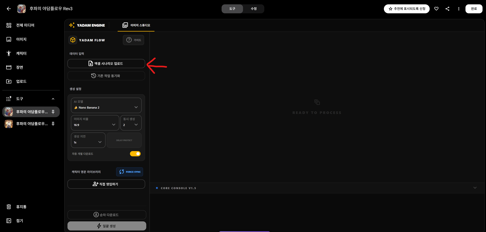

### 6단계 — ① 씬이미지 파일 선택

3단계에서 받은 파일 중 **`(① 씬이미지) …xlsx`** 를 선택합니다. 올라가면 화면에 씬 목록이 나타나고, 위쪽에 **턴어라운드 시트 생성기** 탭이 새로 생깁니다.

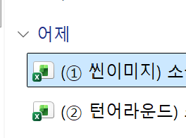

---

## 3. 인물시트(턴어라운드) 생성하기

### 7단계 — 턴어라운드 시트 생성기 탭으로 이동

위쪽의 **`턴어라운드 시트 생성기`** 탭을 누릅니다.

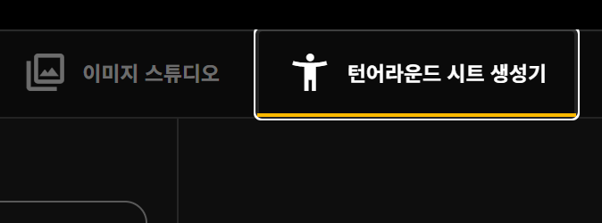

### 8단계 — 캐릭터 엑셀 업로드 누르기

왼쪽 **데이터 입력**의 **`캐릭터 엑셀 업로드`** 를 누릅니다.

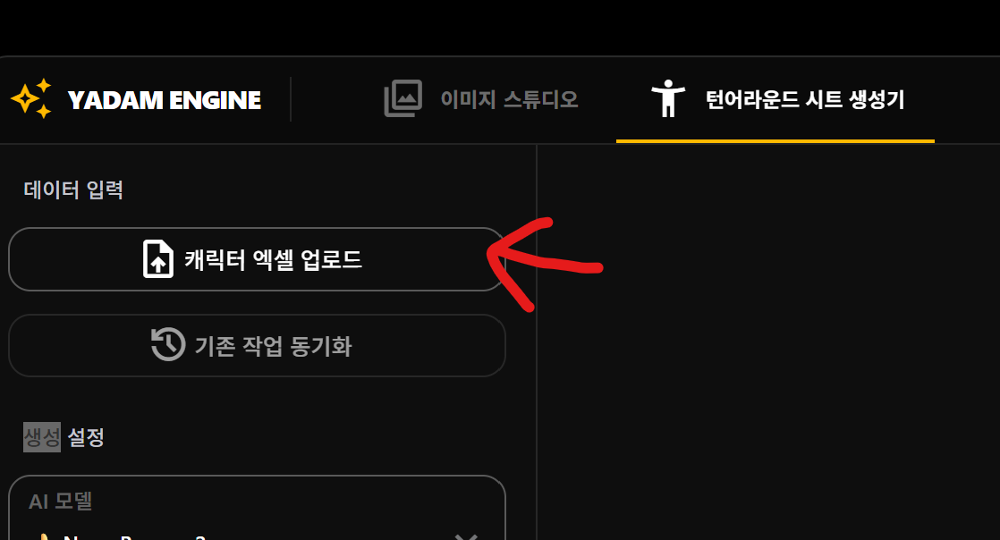

### 9단계 — ② 턴어라운드 파일 선택

이번에는 **`(② 턴어라운드) …xlsx`** 를 선택합니다.

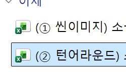

### 10단계 — 인물시트 일괄 생성

아래 콘솔에 **"N명의 캐릭터 정보를 엑셀에서 불러왔습니다"** 가 뜨면, 왼쪽 맨 아래의 **`⚡ 일괄 생성 시작`** 을 눌러 인물시트를 그립니다.

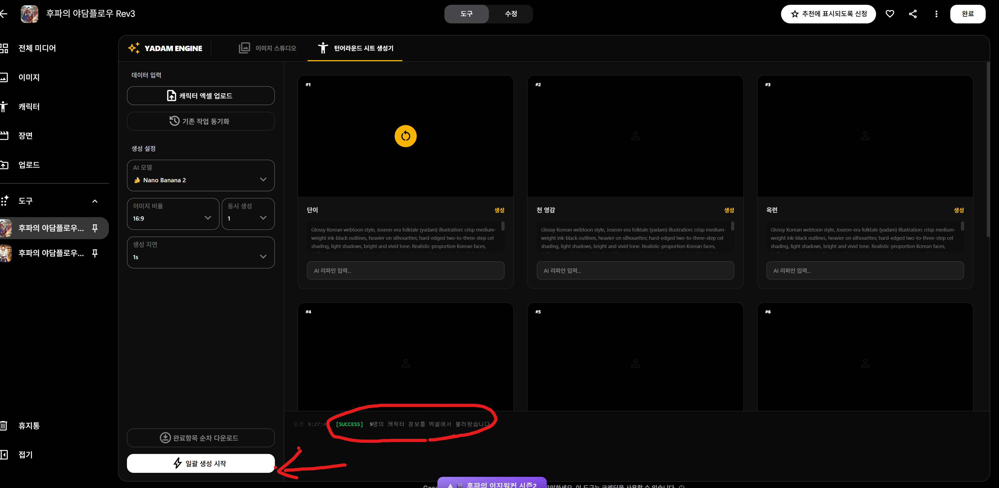

---

## 4. 씬 이미지 일괄 생성

### 11단계 — 캐릭터 라이브러리 연결 확인

인물시트가 다 그려지면 **`이미지 스튜디오`** 탭으로 돌아옵니다. 왼쪽 **캐릭터 영문 라이브러리**에 인물시트가 자동으로 들어가 있고, 콘솔에 **"턴어라운드 캐릭터 N개를 라이브러리에 연결했습니다"** 가 표시됩니다.

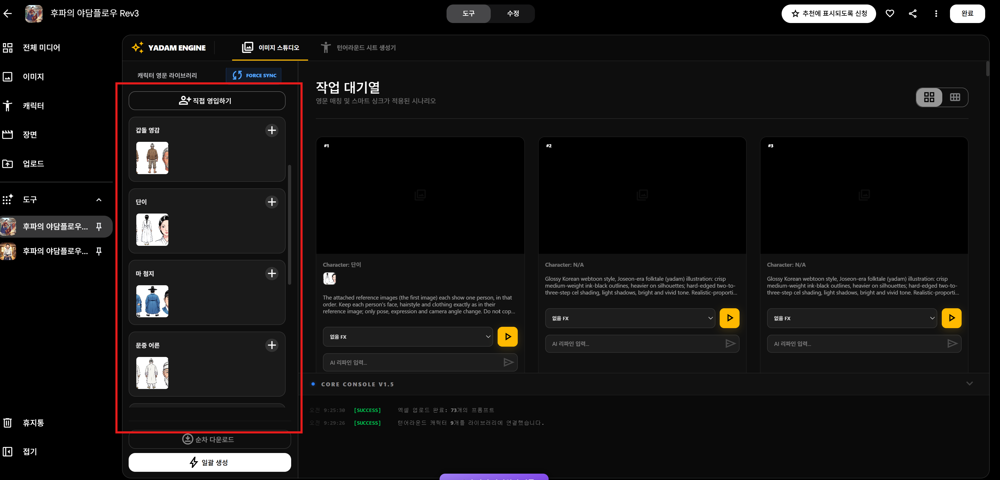

### 12단계 — Character: N/A 씬 확인

씬 카드에 `Character: N/A`라고 나오는 씬은 **등장인물이 없는 씬**(풍경·사물 등)입니다. 인물시트 없이 프롬프트만으로 그려지니 그대로 두면 됩니다.

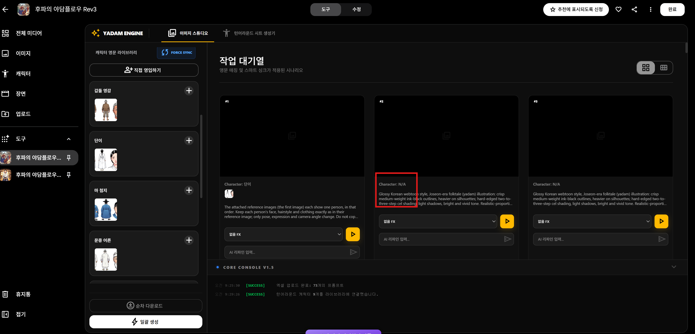

### 13단계 — 일괄 생성 & 이미지 다운로드

왼쪽 맨 아래의 **`⚡ 일괄 생성`** 을 누르면 모든 씬의 이미지 생성이 시작됩니다. 다운로드 방법은 **자동 개별 다운로드** 설정에 따라 다릅니다.

| 자동 개별 다운로드 | 다운로드 방법 |
|------|----------------|
| 🟢 **ON** | 이미지가 **하나 생성될 때마다 자동으로 다운로드**됩니다. 따로 누를 것이 없습니다. |
| ⚪ **OFF** | 이미지가 **모두 완성된 뒤** **`순차 다운로드`** 를 누르면 한 번에 받을 수 있습니다. |

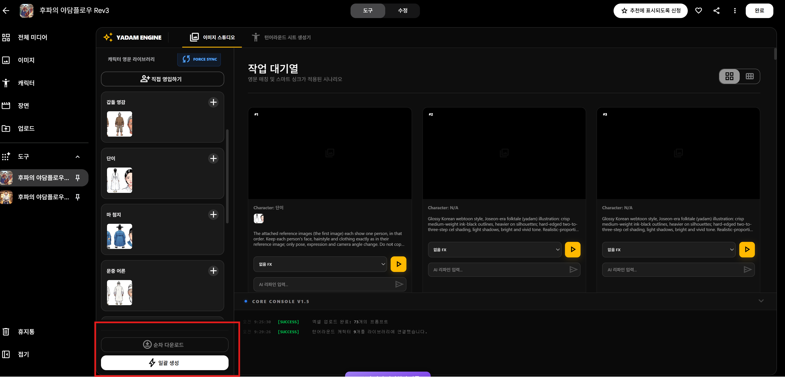

> 💡 **생성 설정**(AI 모델, 이미지 비율, 동시 생성, 생성 지연)은 기본값(Nano Banana 2 · 16:9 · 2 · 1s) 그대로 사용해도 됩니다.

---

© 후파 · 후파의 야담플로우 공식 사용 설명서

