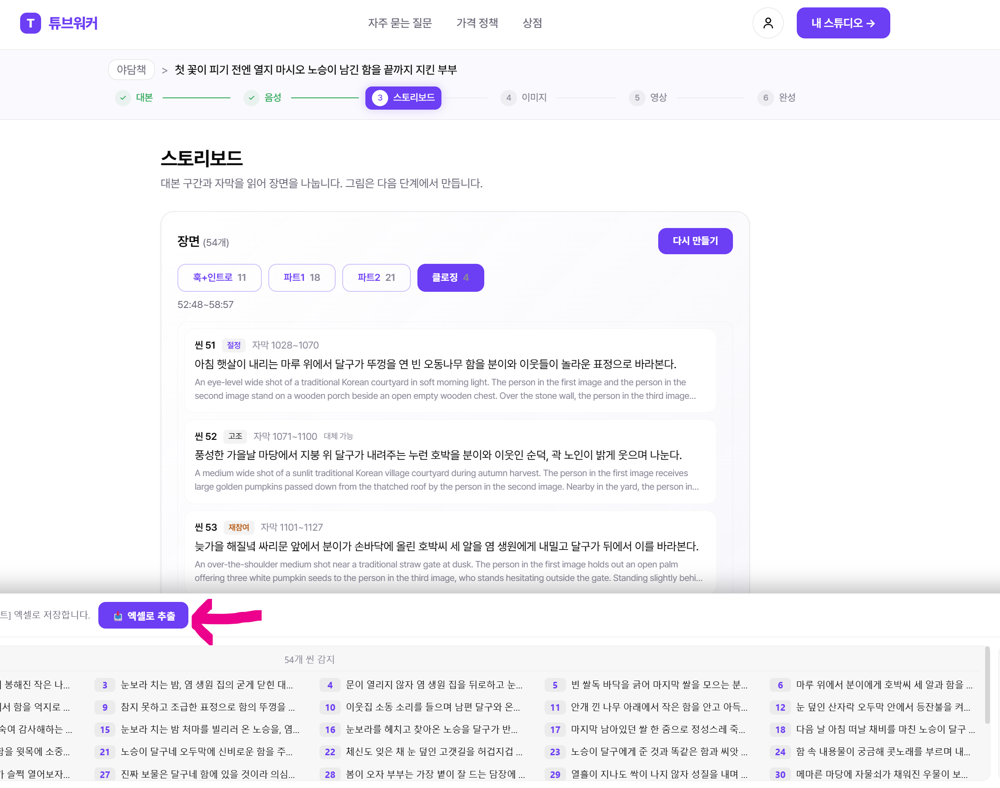
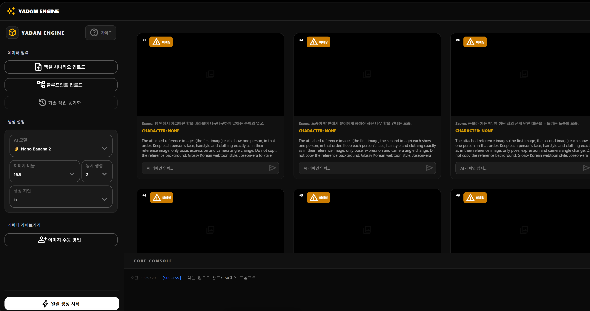
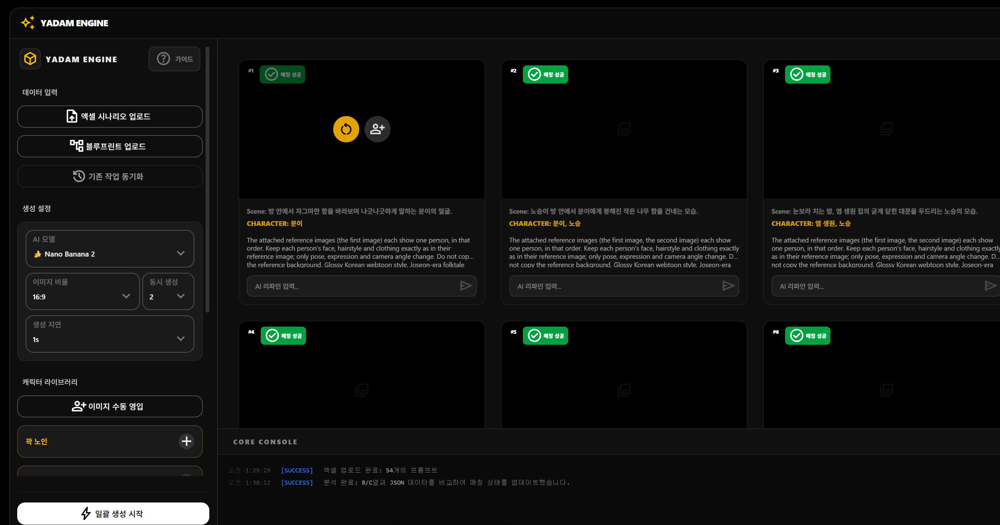

  

<h1 align="center">후파의 야담플로우 사용법</h1>

  <b>공식 사용 설명서</b> 
  튜브워커 엑셀 대본 + 인물시트로 야담 씬 이미지를 한 번에 일괄 생성하기  
  👉 <a href="https://flow.google.com/shared/tool/9a27ddf0-04e6-439b-9ac9-d4b3d00e7dfd"><b>후파의 야담플로우 바로가기</b></a>

---

## 목차

1. [준비물](#준비물)
2. [튜브워커에서 준비하기](#1-튜브워커에서-준비하기) (1~3단계)
3. [야담플로우에 대본 올리기](#2-야담플로우에-대본-올리기) (4~6단계)
4. [인물시트 매칭하기](#3-인물시트-매칭하기) (7~11단계)
5. [일괄 생성](#4-일괄-생성) (12단계)

---

## 준비물

| 파일 | 어디서 얻나요? |
|------|----------------|
| **엑셀 대본** (`.xlsx`) | 튜브워커 → 스토리보드 단계 → **엑셀로 추출** |
| **인물시트 이미지** | 튜브워커 → 이미지 단계 → **인물시트 다운로드** |
| **Blueprint.json** | 클로드코드에서 대본 생성 후 나온 결과물 (튜브워커 음성 생성 때 업로드한 파일과 같은 파일) |

---

## 1. 튜브워커에서 준비하기

### 1단계 — 엑셀 대본 다운로드

튜브워커의 **스토리보드 단계**에서 화면 아래의 **`엑셀로 추출`** 버튼을 눌러 엑셀 대본을 다운로드합니다.

### 2단계 — 인물시트 생성

**이미지 단계**의 **인물 시트** 영역에서 **`전체 재생성`** 버튼을 눌러 인물시트를 생성합니다.

> ⚠️ 인물시트 생성에는 **크레딧이 사용**됩니다.

### 3단계 — 인물시트 다운로드

화면 아래의 **`인물시트 다운로드`** 버튼을 눌러 인물시트를 받습니다. 파일은 `분이.png`, `달구.png`처럼 **인물 이름**으로 저장됩니다.

---

## 2. 야담플로우에 대본 올리기

### 4단계 — 엑셀 대본 업로드

[후파의 야담플로우](https://flow.google.com/shared/tool/9a27ddf0-04e6-439b-9ac9-d4b3d00e7dfd)에 접속합니다. 왼쪽 **데이터 입력**에서 **① `엑셀 시나리오 업로드`** 를 눌러 1단계에서 받은 엑셀 대본을 올립니다.

### 5단계 — Blueprint.json 업로드

엑셀이 올라가면 씬 목록이 나타나고, 각 씬에 주황색 **`미매칭`** 표시가 붙어 있습니다.
이어서 **② `블루프린트 업로드`** 를 눌러 클로드코드에서 대본 생성 후 나온 **`Blueprint.json`** 을 올립니다.

> 💡 튜브워커에서 **음성 생성할 때 업로드했던 파일과 같은 파일**입니다.

### 6단계 — 매칭 성공 확인

Blueprint.json 처리가 끝나면 모든 씬이 초록색 **`매칭 성공`** 으로 바뀌고, 각 씬에 등장인물(`CHARACTER`)이 채워집니다. 왼쪽 아래 **캐릭터 라이브러리**에도 인물 목록이 생깁니다.

---

## 3. 인물시트 매칭하기

### 7단계 — + 버튼 누르기

**캐릭터 라이브러리**에서 인물 이름 옆의 **`+`** 버튼을 눌러 해당 인물의 인물시트를 올립니다.

### 8단계 — 미디어 업로드 선택

`+` 버튼을 누르면 나오는 팝업 메뉴에서 **맨 아래의 `미디어 업로드`** 를 누릅니다.

### 9단계 — 인물시트 일괄 업로드

3단계에서 받아 둔 인물시트를 **한꺼번에 선택**(`Ctrl + A`)해서 업로드합니다.

### 10단계 — 인물 선택

업로드된 목록에서 **인물 이름과 같은 파일**(예: 분이 → `분이.png`)을 선택합니다.
나머지 인물도 `+` 버튼을 눌러 같은 방법으로 선택합니다. 한 번 올린 이미지는 목록에 남아 있으니 다시 업로드할 필요가 없습니다.

### 11단계 — 누락된 인물 수동 매칭

매칭이 끝나면 씬의 `CHARACTER` 옆에 인물 썸네일이 표시됩니다.
썸네일이 빠진 씬이 있다면, **씬에 마우스를 올렸을 때 나오는 👤+ 버튼**을 눌러 인물을 직접 연결합니다.

---

## 4. 일괄 생성

### 12단계 — 일괄 생성 시작

왼쪽 맨 아래의 **`일괄 생성 시작`** 버튼을 누르면 모든 씬의 이미지가 차례대로 생성됩니다.

> 💡 **생성 설정**(AI 모델, 이미지 비율, 동시 생성, 생성 지연)은 기본값(Nano Banana 2 · 16:9 · 2 · 1s) 그대로 사용해도 됩니다.

---

© 후파 · 후파의 야담플로우 공식 사용 설명서

